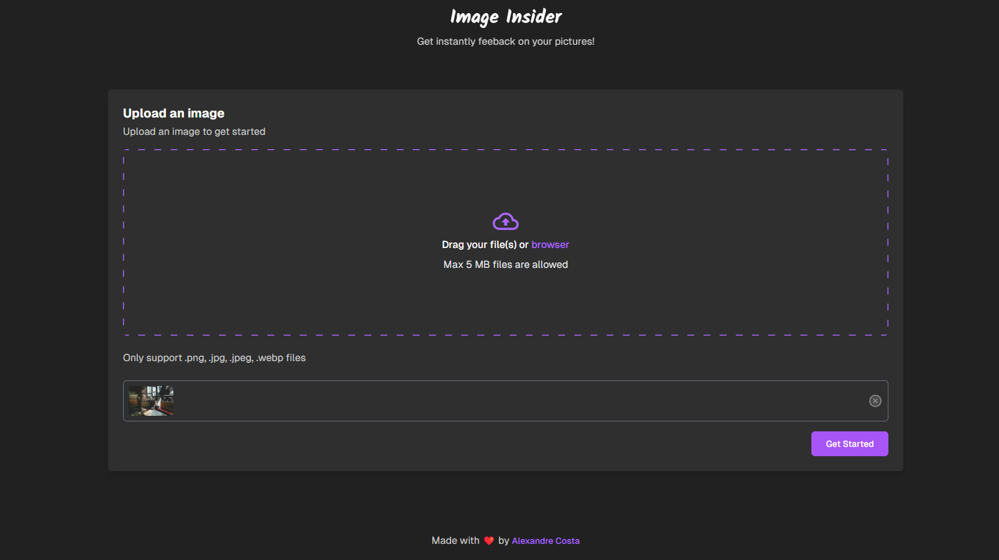
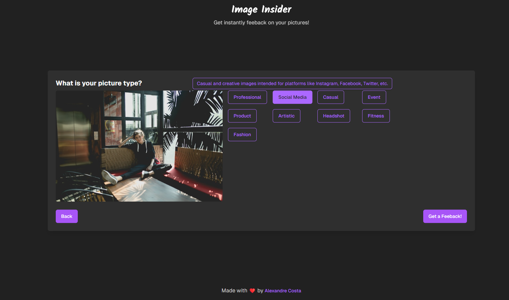
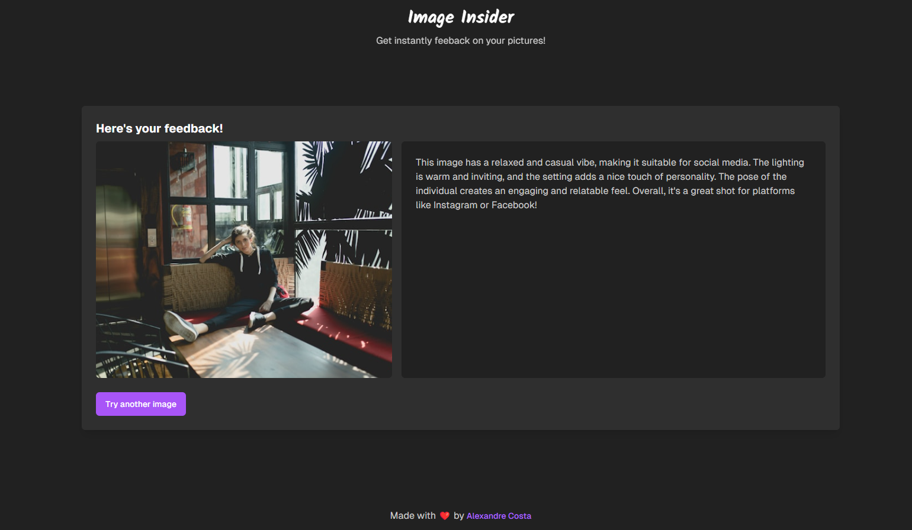

<h1 align="center">
  <a href="https://devpost.com/software/image-insight" target="_blank">Image Insight</a>
  <br />
  <a href="https://www.linkedin.com/in/alexandre-costa-401699199">
    
  </a>
  <a href="https://github.com/alexandredev3/image-insight/network">
    
  </a>
  <a href="https://github.com/alexandredev3/image-insight/stargazers">
    
  </a>
</h1>

<p align="center">
  Introducing Image Insight: A web app that analyzes your photos using OpenAI's generative AI. Get tailored feedback on lighting, environment, and more to perfect your images for any occasion!
</p>

## 📷 Screenshots





## 🛠️ Tools

- [Typescript](https://www.typescriptlang.org/)
- [React.js](https://reactjs.org/)
- [Next.js](https://nextjs.org/)
- [Tailwindcss](https://tailwindcss.com/)
- [Vercel AI SDK](https://sdk.vercel.ai/)

## 🧑‍💻 Running Locally
1. Clone the repository
```bash
git clone [https://github.com/alexandredev3/ignews.git](https://github.com/alexandredev3/image-insight.git)
```

2. Install dependencies
```bash
pnpm install
```

3. Create a `.env` file. See `.env.example` for reference.

4. Start up server!
```bash
pnpm dev
```
Happy hacking🥂


## :man: Author

<a href="https://github.com/alexandredev3/">
 
 <br />
 <sub><b>Alexandre Costa</b></sub>
</a>

Made with :heart: by Alexandre C.🚀
